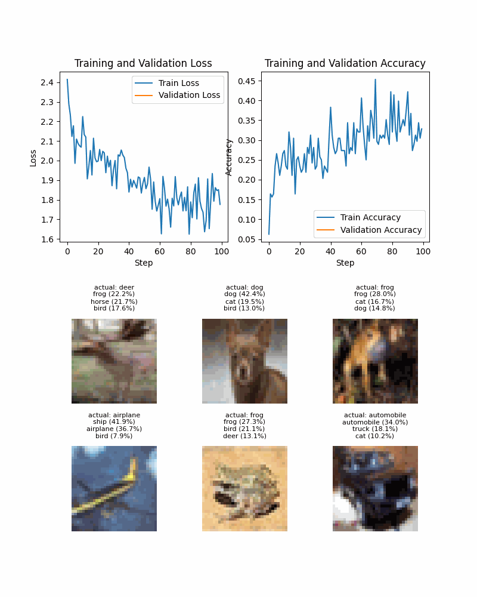
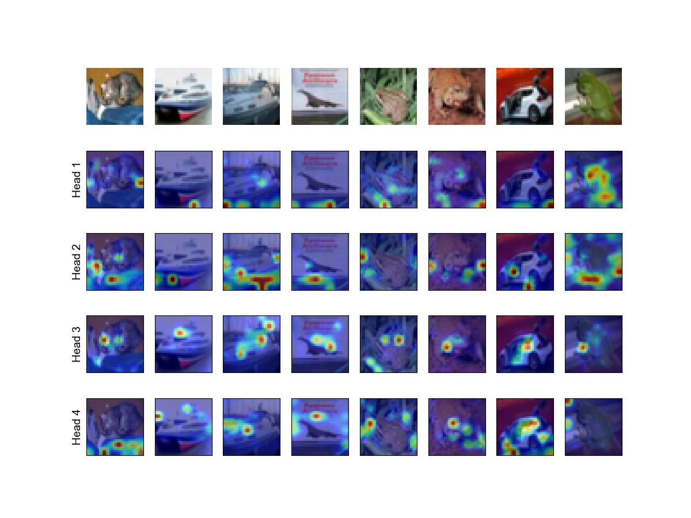
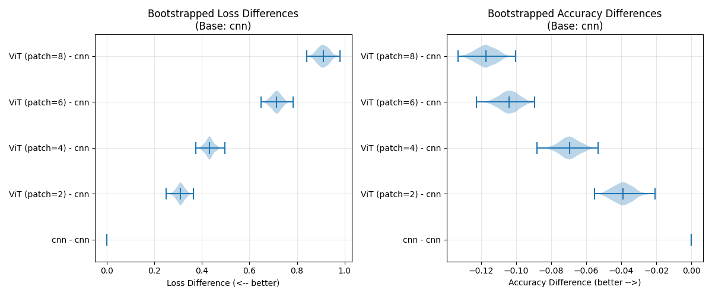
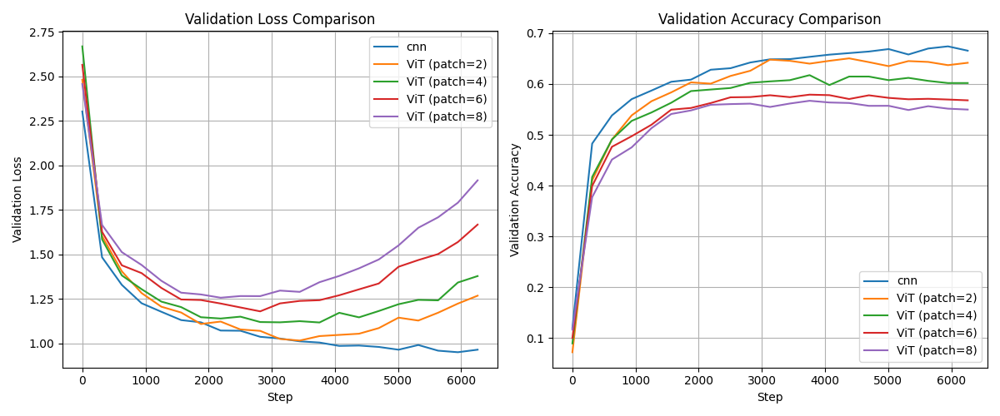

# Vision Transformer Project

A PyTorch-based computer vision project implementing both **Vision Transformers (ViT)** and **Convolutional Neural Networks (CNNs)** for image classification on the CIFAR-10 dataset.



*Training progress visualization showing the convergence of our Vision Transformer over 10 epochs*



*Visualization of learned attention maps after training*

## Table of Contents

- [Model Comparison: Patch Embedding Size](#model-comparison-patch-embedding-size)
  - [Quantitative Results](#quantitative-results)
  - [Training Curves](#training-curves)
  - [Takeaways](#takeaways)
- [Project Overview](#project-overview)
- [Project Structure](#project-structure)
- [Features](#features)
  - [Neural Network Architectures](#-neural-network-architectures)
  - [Training Framework](#-training-framework)
  - [Data Management](#-data-management)
  - [Visualization & Training Progress](#-visualization--training-progress)
  - [Interactive Tutorials & Demos](#-interactive-tutorials--demos)
- [Installation](#installation)
  - [Prerequisites](#prerequisites)
  - [Setup](#setup)
- [Usage](#usage)
  - [Training a Model](#training-a-model)
  - [Interactive Tutorials](#interactive-tutorials)
  - [Custom Training](#custom-training)
  - [Using Vision Transformer](#using-vision-transformer)
  - [Attention Visualization](#attention-visualization)
- [Model Architecture](#model-architecture)
- [Performance](#performance)
  - [CNN Results](#cnn-results)
  - [Vision Transformer Results](#vision-transformer-results)
- [Dependencies](#dependencies)
- [Development Status](#development-status)
  - [Completed](#-completed)
  - [In Progress](#-in-progress)
  - [Planned Features](#-planned-features)
- [Contributing](#contributing)
- [License](#license)
- [Acknowledgments](#acknowledgments)

---

## Model Comparison: Patch Embedding Size

We compared a baseline CNN against Vision Transformers (ViTs) trained from scratch on CIFAR-10 with varying patch sizes.  

### Quantitative Results
| Model           | Test Loss | Test Accuracy |
|-----------------|-----------|---------------|
| CNN             | 0.962     | **67.0%**     |
| ViT (patch=2)   | 1.272     | 63.1%         |
| ViT (patch=4)   | 1.394     | 60.1%         |
| ViT (patch=6)   | 1.675     | 56.6%         |
| ViT (patch=8)   | 1.872     | 55.3%         |

We also computed **bootstrapped accuracy differences** relative to the CNN baseline:

<p align="center">
  
</p>

The CNN consistently outperforms all ViTs, and performance decreases steadily with larger patch sizes.

---

### Training Curves
<p align="center">
  
</p>

The curves highlight two trends:
- The CNN converges faster and reaches higher validation accuracy.
- Smaller patch sizes (e.g., 2×2) help ViTs retain more local detail and improve performance relative to larger patches, but they still lag behind CNNs.

---

### Takeaways
- **Inductive biases matter:** On small datasets like CIFAR-10, CNNs have strong locality and translation equivariance built in, giving them an advantage over ViTs.  
- **ViTs need more data or pretraining:** In low-data regimes, ViTs trained from scratch underperform CNNs, but with sufficient scale or augmentations they can surpass CNNs.  
- **Patch size tradeoff:** Smaller patches preserve detail and perform better, while larger patches discard local structure and hurt accuracy.  

In short: on CIFAR-10, a simple CNN beats a ViT trained from scratch, but the ViT results align with known trends from the literature.


## Project Overview

This project provides a complete training pipeline for image classification using PyTorch, featuring:
- **CNN Architecture**: A custom convolutional neural network designed for CIFAR-10
- **Vision Transformer (ViT)**: A fully functional transformer-based architecture with attention mechanisms
- **Training Framework**: A robust `Runner` class that handles training, validation, and testing
- **Data Management**: Automatic CIFAR-10 dataset download and preprocessing
- **Visualization**: Built-in plotting capabilities with animated training progress GIFs and attention map visualization
- **Model Persistence**: Save and load functionality for trained models
- **Interactive Demos**: Jupyter notebooks for tutorials and attention visualization

## Project Structure

```
vision-transformer/
├── network.py          # Neural network architectures (CNN, FeedForward, ViT)
├── runner.py           # Training orchestration and metrics tracking
├── train.py            # Main training script (updated for 20 epochs)
├── setup_cifar.py      # CIFAR-10 dataset setup utilities
├── utils.py            # Utility functions for GIF generation
├── requirements.txt    # Python dependencies
├── .gitignore          # Git ignore rules
├── data/               # CIFAR-10 dataset storage
│   └── cifar-10-batches-py/  # CIFAR-10 data files
├── demos/              # Interactive tutorials and demonstrations
│   ├── vit_tutorial.ipynb     # Vision Transformer code explanation
│   └── attention_maps.ipynb   # Attention visualization tutorial
├── figures/            # Generated plots and visualizations
│   └── attention_maps.png     # Example attention map visualization
├── saved/              # Trained model checkpoints
│   └── VisionTransformer.pt   # Pre-trained ViT model
├── animation_vit.gif   # Training progress animation
└── .venv/              # Virtual environment (excluded from git)
```

## Features

### 🧠 Neural Network Architectures

**CNN (Convolutional Neural Network)**
- 2 convolutional layers with ReLU activation
- Max pooling for dimensionality reduction
- Fully connected output layer for 10-class classification
- Optimized for CIFAR-10 (32x32x3 images)

**FeedForward Network**
- Simple multi-layer perceptron
- Configurable input, hidden, and output sizes
- ReLU activation function

**Vision Transformer (ViT)**
- Complete transformer-based architecture for image classification
- Patch embedding with 4×4 patches (64 patches for 32×32 images)
- Multi-head self-attention mechanism
- Learnable CLS token and positional embeddings
- Configurable number of transformer blocks and attention heads
- Optimized for CIFAR-10 classification

### 🚀 Training Framework

**Runner Class**
- Comprehensive training loop with progress bars
- Real-time metrics tracking (loss, accuracy)
- Validation during training
- Automatic device detection (MPS/GPU/CPU)
- Built-in plotting and visualization
- Model checkpointing and restoration

**Key Features**
- Automatic device selection (Apple Silicon MPS, CUDA, or CPU)
- Progress bars with live metrics display
- Comprehensive metrics logging
- Validation at each epoch
- Final test evaluation
- **Animated training progress visualization** with GIF generation

### 📊 Data Management

**CIFAR-10 Dataset**
- Automatic download and setup
- Train/validation split (80/20)
- Data augmentation with normalization
- Batch processing with configurable batch sizes

### 📈 Visualization & Training Progress

**Real-time Metrics Display**
- Live progress bars with current epoch, loss, and accuracy
- Training and validation metrics updated in real-time
- Comprehensive logging of all training steps

**Animated Training Progress**
- Automatic generation of training progress GIFs
- Visual representation of convergence over multiple epochs
- Frame-by-frame breakdown of training evolution
- Customizable animation parameters (frame duration, transitions)

**Attention Map Visualization**
- Extract and visualize attention weights from trained ViT models
- Overlay attention maps on input images
- Understand what the model "sees" when making predictions
- Interactive Jupyter notebook tutorial

### 🎓 Interactive Tutorials & Demos

**ViT Tutorial Notebook** (`demos/vit_tutorial.ipynb`)
- Step-by-step explanation of Vision Transformer components
- Code breakdown and architecture visualization
- Practical examples and demonstrations
- Understanding transformer blocks, attention mechanisms, and patch embeddings

**Attention Maps Tutorial** (`demos/attention_maps.ipynb`)
- Complete guide to attention visualization
- Extract attention weights from trained models
- Generate attention heatmaps overlaid on images
- Analyze model interpretability and decision-making process

## Installation

### Prerequisites
- Python 3.8+
- PyTorch 2.0+
- Apple Silicon Mac (for MPS acceleration) or CUDA-capable GPU
- Jupyter Notebook (for interactive demos)

### Setup

1. **Clone the repository**
   ```bash
   git clone <repository-url>
   cd vision-transformer
   ```

2. **Create and activate virtual environment**
   ```bash
   python -m venv .venv
   source .venv/bin/activate  # On macOS/Linux
   # or
   .venv\Scripts\activate     # On Windows
   ```

3. **Install dependencies**
   ```bash
   pip install -r requirements.txt
   ```

4. **Install Jupyter for interactive demos**
   ```bash
   pip install jupyter
   ```

## Usage

### Training a Model

Run the main training script:
```bash
python train.py
```

This will:
1. Download CIFAR-10 dataset (if not already present)
2. Train a Vision Transformer model for 20 epochs
3. Display training progress with live metrics
4. Generate training plots and animated GIF
5. Save the trained model as `VisionTransformer.pt`
6. Report final test performance

### Interactive Tutorials

**Start Jupyter Notebook server:**
```bash
cd demos
jupyter notebook
```

**Available Tutorials:**
- **ViT Tutorial**: Learn about Vision Transformer architecture and components
- **Attention Maps**: Visualize attention weights and understand model decisions

### Custom Training

Modify `train.py` to:
- Change the number of epochs (currently set to 20)
- Use different models (CNN, FeedForward, or VisionTransformer)
- Adjust hyperparameters (learning rate, batch size, model architecture)
- Change the validation split ratio

### Using Vision Transformer

To train with the Vision Transformer architecture:

```python
from network import VisionTransformer

# Create ViT model with custom parameters
model = VisionTransformer(
    img_size=32,        # CIFAR-10 image size
    hidden_size=64,     # Embedding dimension (updated from 128)
    output_size=10,     # Number of classes
    num_heads=4,        # Number of attention heads (updated from 8)
    num_blocks=4        # Number of transformer blocks (updated from 6)
)

# Use with existing training pipeline
runner = Runner(model, optimizer, criterion, device)
runner.train(train_loader, val_loader, epochs=20)  # Updated to 20 epochs
```

### Attention Visualization

After training a model, use the attention maps tutorial:

```python
# Load trained model
model = VisionTransformer.load("saved/VisionTransformer.pt")

# Extract attention weights
with torch.no_grad():
    # Forward pass to get attention weights
    output = model(images, return_attention=True)
    attention_weights = output['attention_weights']
    
# Visualize attention maps
visualize_attention_maps(images, attention_weights)
```

## Model Architecture

**CNN Architecture Details:**
```
Input: 3x32x32 (RGB image)
├── Conv2d(3→16, kernel=3x3, padding=1) + ReLU
├── MaxPool2d(2x2)
├── Conv2d(16→32, kernel=3x3, padding=1) + ReLU
├── MaxPool2d(2x2)
├── Flatten: 32×8×8 → 2048
└── Linear(2048→10) → Output
```

**Vision Transformer (ViT) Architecture Details:**
```
Input: 3x32x32 (RGB image)
├── Patch Embedding:
│   ├── Conv2d(3→64, kernel=4x4, stride=4) → 8x8 patches
│   ├── Flatten patches → 64 patches × 64 dimensions
│   ├── Add CLS token → 65 patches × 64 dimensions
│   └── Add positional embeddings
├── Transformer Blocks (4 blocks):
│   ├── LayerNorm + Multi-Head Attention (4 heads)
│   ├── Residual connection
│   ├── LayerNorm + Feed-Forward Network (GELU activation)
│   └── Residual connection
├── Extract CLS token representation
└── Linear(64→10) → Output
```

**Key ViT Components:**
- **Patch Embedding**: Divides 32×32 images into 4×4 patches (64 patches total)
- **CLS Token**: Learnable classification token prepended to patch sequence
- **Positional Embeddings**: Learnable positional information for each patch + CLS token
- **Multi-Head Attention**: 4 attention heads for different feature aspects
- **Transformer Blocks**: Stack of 4 self-attention and feed-forward layers with residual connections
- **Layer Normalization**: Stabilizes training and improves convergence
- **GELU Activation**: Smooth activation function used in modern transformers

## Performance

### CNN Results
The CNN implementation achieves:
- **Training Accuracy**: ~60% (after 1 epoch)
- **Test Accuracy**: ~52% (after 1 epoch)
- **Training Time**: ~20 seconds per epoch on Apple Silicon M1

### Vision Transformer Results
Our fully trained Vision Transformer achieves:
- **Final Test Loss**: 1.1176
- **Final Test Accuracy**: 60.63%
- **Training Time**: ~7-9 seconds per epoch on Apple Silicon M1
- **Convergence**: Stable training over 20 epochs with consistent improvement
- **Model Size**: Optimized architecture with 64 hidden dimensions and 4 transformer blocks

## Dependencies

- **PyTorch** (≥2.0.0): Deep learning framework
- **TorchVision** (≥0.15.0): Computer vision utilities
- **Matplotlib** (≥3.5.0): Plotting and visualization
- **NumPy** (≥1.21.0): Numerical computing
- **Pillow** (≥8.0.0): Image processing
- **Jupyter**: Interactive notebook environment
- **tqdm**: Progress bars (installed separately)

## Development Status

### ✅ Completed
- CNN architecture implementation
- Vision Transformer (ViT) architecture implementation
- Complete transformer components (attention, positional embeddings, patch embedding)
- **Fully trained ViT model with 60.63% test accuracy**
- Training framework with metrics tracking
- CIFAR-10 data pipeline
- Model saving/loading
- Training visualization with animated progress GIFs
- Virtual environment setup
- Comprehensive .gitignore
- **Interactive Jupyter notebook tutorials**
- **Attention map visualization capabilities**
- **Updated training parameters (20 epochs, optimized architecture)**

### 🔄 In Progress
- Model performance optimization
- Hyperparameter tuning for both architectures
- Performance comparison analysis

### 📋 Planned Features
- Advanced data augmentation
- Learning rate scheduling
- Early stopping
- Cross-validation
- Model ensemble methods
- Transfer learning support
- Extended training runs (50+ epochs)
- Additional visualization tools
- Model interpretability analysis
- Performance benchmarking

## Contributing

1. Fork the repository
2. Create a feature branch
3. Make your changes
4. Add tests if applicable
5. Submit a pull request

## License

This project is licensed under the MIT License - see below for details:

```
MIT License

Copyright (c) 2024 Jordan Lei

Permission is hereby granted, free of charge, to any person obtaining a copy
of this software and associated documentation files (the "Software"), to deal
in the Software without restriction, including without limitation the rights
to use, copy, modify, merge, publish, distribute, sublicense, and/or sell
copies of the Software, and to permit persons to whom the Software is
furnished to do so, subject to the following conditions:

The above copyright notice and this permission notice shall be included in all
copies or substantial portions of the Software.

THE SOFTWARE IS PROVIDED "AS IS", WITHOUT WARRANTY OF ANY KIND, EXPRESS OR
IMPLIED, INCLUDING BUT NOT LIMITED TO THE WARRANTIES OF MERCHANTABILITY,
FITNESS FOR A PARTICULAR PURPOSE AND NONINFRINGEMENT. IN NO EVENT SHALL THE
AUTHORS OR COPYRIGHT HOLDERS BE LIABLE FOR ANY CLAIM, DAMAGES OR OTHER
LIABILITY, WHETHER IN AN ACTION OF CONTRACT, TORT OR OTHERWISE, ARISING FROM,
OUT OF OR IN CONNECTION WITH THE SOFTWARE OR THE USE OR OTHER DEALINGS IN THE
SOFTWARE.
```

## Acknowledgments

- CIFAR-10 dataset creators
- PyTorch development team
- Apple Silicon MPS support
- Jupyter project contributors

---

**Last Updated**: December 2024
**Status**: Active Development
**Version**: 1.1.0
